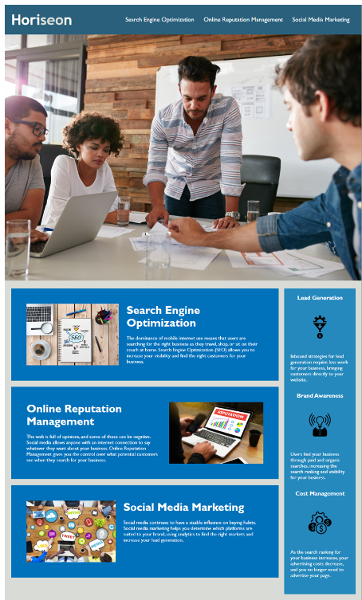

# Refactored Code for Horiseon website

### The HTML and CSS code for this website has been refactored to meet accessibility standards. It is now more organized and easier to read.

* The HTML now uses semantic elements that follow a logical structure. 

* The selectors and properties within the CSS have been consolidated and organized, comments have also been added to the CCS file. 

* The links now function correctly.
### I understand that for assistive technology to be used effectively on a webpage, the HTML must use semantic elements that follow a logical structure.  This is important from a business standpoint because the more people that can visit a webpage, the better.  Also, from a legal standpoint, to avoid any conflict with the Americans with Disabilities Act (ADA).
### In addition, the use of semantic HTML elements and structure makes it much easier for a developer to work on existing code.  Consolidating and organizing the CSS file and adding comments also makes existing code simpler to understand, this can increase productivity which is great for everybody!

[Click here to view the website](https://emmagollan.github.io/accessibility-a11y)

